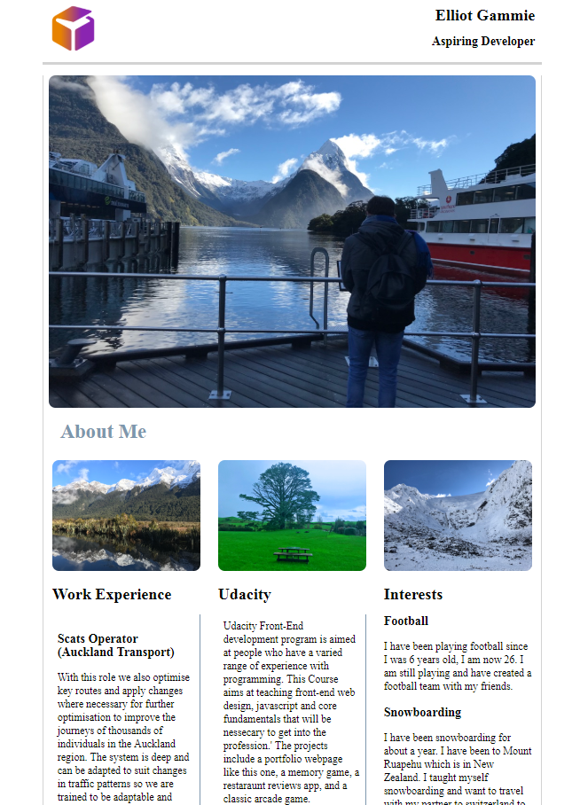

# Project Overview

In this project I was given a PDF file that was used as a mockup of the webpage I would design. As this was the first project I was working on it was mainly focused
around using HTML and CSS with one JS command that would be used for a menu that would pop out for mobile users, or if the size of the browser was small enough.

## Why this Project?

Creating a webpage and understanding HTMl and CSS is an important part of the design process, it forms the foundation of a webpage or application. This was helpful as responsiveness is super important to the design and build process. This is because mobile phones are the most used platform currently.

# Running the Application

1. Download the repo off github.

2. The application's opening /viewing point is at ProjectOne.html. Download this file, it will then need to be opened within a browser.
